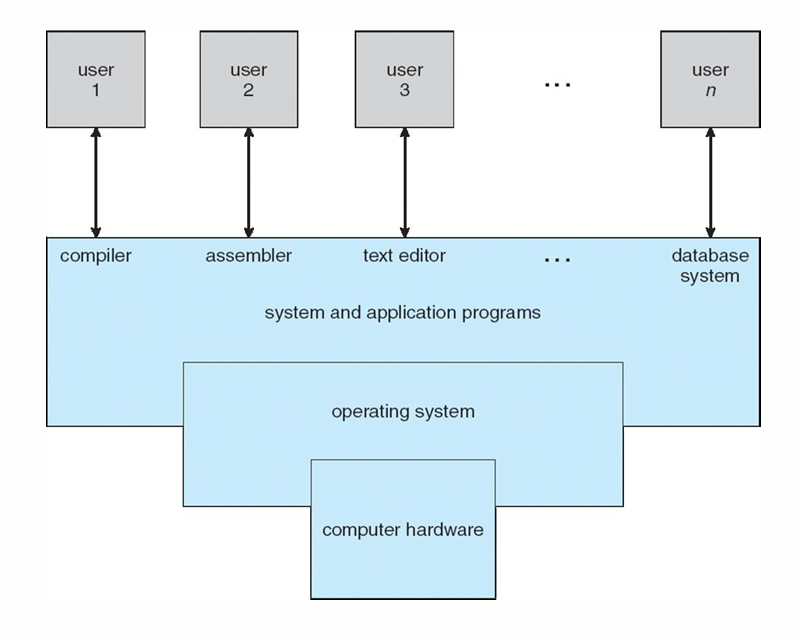

## Contents

- [Hardware Things](#hardware-things)
    - [x86 CPU](#x86-cpu)
        - [Level 0 Ring](#level-0-ring)
        - [Level 3 Ring](#level-3-ring)
        - [Level 1 & 2 Rings](#level-1--2-rings)
    - [Memory](#memory)
- [Files and Other Shit](#files-and-other-shit)
    - [Magic Numbers](#magic-numbers)
    - [Large Language Models (LLM)](#large-language-models-llm)
- [The Bootup](#the-bootup)
- [Introduction](#introduction)
    - [What is an Operating System?](#what-is-an-operating-system)
    - [Goals of the Operating System](#goals-of-the-operating-system)
    - [Computer System Structure and Components](#computer-system-structure-and-components)
    - [Pourpose of the Operating System](#pourpose-of-the-operating-system)

---
<br>

# Hardware Things

## x86 CPU

- x86 CPU architecture will be mainly used for this course.

- This it the intel hardware architecture.
- The CPU has 4 rings, starting from 0 to 3.
- These rings have different previlage levels.

### Level 0 Ring.
- The ring 0 is the innermost ring and have the highest access level compaired to all other rings.
- Level 0 Ring can run any instruction.
- If an level that tries to run instructions that needs permission of level 0, those will create faults and will not run the instruction.
- This ring of the CPU allows to **change the level of the instruction** of itself and others.

### Level 3 Ring
- This level have the lowest permissions.
- An instrucion/process in this level is **not** allowed to change the ring level of any instruction (itself and other instrucitons).

### Level 1 & 2 Rings
- These are not really important because, Linux only uses ring level 0 and 3.

## Memory

- There are some memory that are hardcoded by the manufacture to the mother board, i.e. ROM.
- The CPU don't know the difference between the ROM and the RAM, it sees everything as memory.
- A single memory cell store one cell 1 or 0, Not *nothing*.
- There is no concept of erasing memory, just transforming it.
- One instruction can be stored in more than 1 memory cell.

```bash
sudo cat /proc/iomem
```

- The above command shows the system's memory map, with the currently mapped regions with their **start and end addressed**.


# Files and Other Shit

- All files are just a set of bits.
- Anything can be interpreted in anyway.
- For example, an image can be represented as, 
    - an image duh
    - text (if opened with text editor)
    - a `n` dimention vector, if you consider each bit as one vector.
- Files and other conceptss can be interpreted in many different ways for our advantage.

## Magic Numbers

- These tell what a file acturlly is on a linux system.
    - In shell scripts this is `#!/bin/bash`.
    - In Java class files it is `CAFE BABE`
- Custom magic number interpretation can be stored in `/etc/magic` file.

## Large Language Models (LLM)

- Theses consider everyting as vectors.
- These vectors are multiplied and transformed to make shit work.
- When the prompts or things are tokenized those individual tokens are vectors and depending on the closeness of the next token, that vector is transforned closer.
- LLMs don't use matrices like but rather they use **tensor calculations** for data manipulation and transformation.
- The reason that LLMs use the GPU mainly is the calulations that are done is virtually identical to that of images. Hence the GPU is optimized to do these kinds of calculations.


# The BootUp

- When the machine is turned on,
    - Registers are completely random (Because they are volatile).
    - Program Counter poins to a random address, since Program counter is also a register.
        > To solve this issue, ususlly the program counter is hardcoded to a initial address on the ROM.
        > This hardcoded program counter in an X86 system is **0xFFFF0**, Just 16 bytes below the last address. (Since the size is considered to be 1 MB)
        > This is done because it is much cheaper to hardcode a register thats why only the program counter is hardcoded.
    - Tha instruction in the address hardcoded in the program counter contains a `JMP` statement that points to the start of the ROM containing the BIOS.
    - This jump statement is done for flexibility because, it is much easier to find the end of the memory rather than finidng the start.
    - The BIOS (Basic Input Output System) is stored in the ROM and this hardcoded program counter points to the start of this program..
    - In an **x86** ROM the machine is assumed to have **1 MB** of memory at start, eventhough it could be more.

- During bios a process is started called **POST** (Power On Self Test) that checks the hardware of the machine.
- The POST tests the hardware and give a beep code depending on the error.
- This usually checks if the crusial parts are attached to the machine, like the memory.
- This beep code can differ depending on the error.
- In the POST the memory is also checked for corruptions or any issue.
- For newer sysetms, There is no BIOS, they have UEFI (Unified Extensible Firmware Interface).
- In some point in the BIOS, there will be a `JMP` statement to get the **Master Boot Record (MBR)** from the hard disk.
- MBR is located in the **0**th sector of the hard disk and is loaded to the RAM.
- When data in the disk is coppied to the memory, it is coppied in sectors to save time, since it is much shower to get something from the disk rather than the memory.
- After the master boot record is coppied to the RAM, it will check the *magic number* in the MBR.
- The MBR contains the BOOT CODE which is **446 Bytes**, the **page table** and the **magic number**, all in the first sector of the disk. 
- The process is passed to the code in the MBR from the BIOS.
- The magic number is in 2 parts **MSB** and **LSB**, since it is 2 bytes long.
- This MSB and LSB can be read from MSB to LSB but,
    - MSB address is before address of LSB
        > Called **Big Endian**
        > Found in **power user** machines
    - LSB address is before address of MSB
        > Called **Little Endian**
        > Found in **intel** machines


# Introduction

## What is an Operating System?

- Operating syatem manages the hardware and allow other software and applications to interact with the hardware.
- It is just a program that interacts with the **user** and the **hardware**.
- It provides an environment for the applications to interact with the hardware.
- Assume on a single processor single core machine, the operating system and the applications swap their processes to run virtualy at the same time since the swap time is indistinguishible by a human.

## Goals of the Operating System

- Make it easier to execute user programs.
- Manage the computer hardware in an efficient manner.


## Computer System Structure and Components

- Hardware - Provides the basic computing resources.
- Operating System - Controls and coordinates hardware components between the user and applications.
- Application Programs - Define ways system resources are used to solve computing problems.
- Users - People, machines, or other computers that use the hardware through the operating system or applications.



## Pourpose of the Operating System

- Make it convenient for users while trying to maintain good performance.
- Other stuff **depends** on how one wants to use it.
 Operating system is a resource allocator, managing hardware resources efficientsly.
- Controls the execution of programs preventing from critical errors, and improper use of hardware resources.

- There are few types of programs that is running on the operating system, 
    1. Kernel - Always running in the machine.
    2. System Applications - Utilities and programs that help to interact with the operating system.
    3. Applications - Specific programs as per user need.


